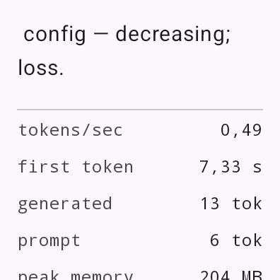

# WatchLLM — mały LLM na zegarku z Androidem

Port [Apple-Watch-Edge-AI](https://github.com/andrisgauracs/Apple-Watch-Edge-AI)
z watchOS na Androida (Wear OS 3+ i pełnoekranowe zegarki/androidowe telefony).
Ten sam pomysł: **ilościowo mały model, w całości na urządzeniu, upstream
llama.cpp**, tokeny na ekranie i statystyki benchmarku na żywo.

Modele (przełącznik w apce, wszystkie offline):

| model | rozmiar | język | typ |
|---|---|---|---|
| **GoLLeM-110M-PL-SFT** (domyślny) | 73 MB Q4 | 🇵🇱 polski | instrukcyjny (SFT), GPT-2 |
| Pollock Mini LM 125M Q4 | 88 MB | 🇬🇧 angielski | base, GPT-2 + SwiGLU (patch) |
| Pollock Mini LM 125M Q8 | 135 MB | 🇬🇧 angielski | base, GPT-2 + SwiGLU (patch) |

GoLLeM ([SlayerLab/goLLeM-110M-PL-SFT-merged](https://huggingface.co/SlayerLab/goLLeM-110M-PL-SFT-merged),
CC-BY-SA-4.0) to mały polski model z fabryka.ai/SlayerLab — jedyna wersja
odpowiadająca na pytania (SFT), nie tylko kontynuująca tekst. Pollock
([SlayerLab/pollock-mini-lm-125m](https://huggingface.co/SlayerLab/pollock-mini-lm-125m))
dokłada drugi punkt odniesienia (angielski, inna architektura MLP). Porównanie
i uzasadnienie: [docs/MODEL.md](docs/MODEL.md).

> Pollock to surowy model bazowy (kontynuacja tekstu, po angielsku), bez
> instruction tuningu i alignmentu — patrz „Ograniczenia" w docs/MODEL.md.

Uwagi i propozycje treningu dla modeli SlayerLab/fabryka.ai z pracy przy tym
porcie: [docs/MODEL_REVIEW.md](docs/MODEL_REVIEW.md).

<p align="center">
  
</p>

## Jak to zbudowane

```
tools/                     model + weryfikacja
  setup_llamacpp.*         klonuje pinowanego llama.cpp do vendor/ + patch
  pollock-swiglu.patch     SwiGLU w architekturze gpt2 (patrz docs/LLAMACPP_PATCH.md)
  convert_pollock_to_gguf.py  HF safetensors -> GGUF (split c_fc na gate/up)
  fetch_model.sh           pobiera model, konwertuje, kwantyzuje do models/bundled/
  build_llamacpp_host.bat  host build llama.cpp + greedy_probe (weryfikacja)
  parity_check.py          greedy HF vs GGUF — musi być 100% zgodne
  test_tool.py             test Tools.json bez przebudowy apki
app/src/main/
  cpp/llm_jni.cpp          mostek JNI do llama.h (odpowiednik LlamaCppEngine.swift)
  java/dev/watchllm/
    LlmRunner.kt           stan, streaming, narzędzia web, park/resume (LLMRunner.swift)
    ToolBox.kt             deklaratywne narzędzia web (Tools.swift)
    ui/WatchLLMApp.kt      Compose: model picker, wejście głosowe/klawiatura, statystyki
models/bundled/            GGUF-y trafiają do APK jako assety (katalog git-ignored)
```

## Szybki start (Windows)

Wymagania: `git`, `python` (3.10+), Visual Studio z C++ (konsola „x64 Native
Tools"), do zbudowania APK — JDK 17 + Android SDK/NDK/CMake (wystarczy Android
Studio).

```powershell
# 1. llama.cpp (pinowany commit + patch SwiGLU) + narzędzia hosta
#    (llama-quantize, greedy_probe — potrzebne w kroku 2)
powershell -ExecutionPolicy Bypass -File tools\setup_llamacpp.ps1
cmd /c tools\build_llamacpp_host.bat

# 2. model: pobranie (512 MB) + konwersja + kwantyzacja Q4_K_M (88 MB) i Q8_0 (135 MB)
powershell -ExecutionPolicy Bypass -File tools\fetch_model.ps1
#    (Linux/macOS: tools/setup_llamacpp.sh + tools/build_llamacpp_host.sh + tools/fetch_model.sh)

# 3. weryfikacja poprawności konwersji — oczekiwany wynik: "PARITY OK"
#    (near-tie flip w granicach błędu float jest raportowany, nie karany)
python tools\parity_check.py --gguf models\pollock-mini-lm-125m-f32.gguf
#    (ściślej: f32; dla f16/Q4/Q8 near-tie flipy są naturalne)

# 4. APK
gradlew assembleDebug          # app\build\outputs\apk\debug\app-debug.apk

# 5. wgranie na zegarek (Wear OS: adb przez Wi-Fi)
powershell -ExecutionPolicy Bypass -File tools\install_watch.ps1 pair    192.168.0.23:37123   # kod sparowania z ekranu zegarka
powershell -ExecutionPolicy Bypass -File tools\install_watch.ps1 install 192.168.0.23:37123   # instalacja + auto-bench z logatami
```

Wymagania na zegarku: Opcje programisty (5× stuknąć w „Numer kompilacji") →
WŁ. „Debugowanie ADB" + WŁ. „Debugowanie przez Wi-Fi" — zegarek pokaże adresy
do sparowania i połączenia. Bluetooth nie wystarcza (Wear OS 3 nie przenosi
adb po BT).

Nie masz `gradle`? Wygeneruj wrapper raz: `gradle wrapper --gradle-version 8.10.2`
albo otwórz projekt w Android Studio i zbuduj stamtąd.

## Używanie

1. **Zapytanie** — pole tekstowe korzysta z systemowej klawiatury/dyktowania
   (na Wear OS: Gboard voice). Przycisk **Ask** startuje generowanie, **Stop**
   przerywa.
2. **Przełącznik modelu** — Q4 (88 MB, domyślnie; mieści się wszędzie) albo
   Q8 (135 MB; minimalnie lepsza jakość, wymaga ~250 MB RAM w szczycie).
3. **Statystyki** — tok/s, czas do pierwszego toku, liczba tokenów, peak PSS,
   rozmiar wag, rozmiar KV cache, liczba wątków. Dokładnie te same pola co
   w oryginale — dane z benchmarków są porównywalne między platformami.
4. **Park/resume** — po zejściu na tło generowanie zatrzymuje się na granicy
   tokenu, KV cache zostaje; po powrocie kontynuuje dokładnie.
5. **Tryb benchmarku** — `adb shell am start -n dev.watchllm/.MainActivity --ez bench true`
   generuje stały prompt startowy i loguje linię `BENCH tok/s=... ttft=...`
   (odpowiednik `FH1_AUTORUN` z oryginału; tag logcat: `WatchLLM`).

## Narzędzia web (opcjonalnie)

Mechanizm z oryginału: dopasowane narzędzie (pogoda, BTC, USD→EUR, Wikipedia)
wykonuje zapytanie **przed** generowaniem, a wynik trafia do promptu jako jedno
zdanie faktu. Sam model nigdy nie dotyka sieci. Konfiguracja narzędzi leży w
`app/src/main/assets/Tools.json` (git-ignored) — bez tego pliku aplikacja jest
w pełni offline i nie wymaga żadnych uprawnień.

```powershell
copy app\src\main\assets\Tools.example.json app\src\main\assets\Tools.json
python tools\test_tool.py "what is bitcoin trading at"
```

Zasada fail-closed (z oryginału): jeśli narzędzie nie odpowie, model **nie**
zostaje zapytany — mały model zmyśliłby liczby. Przy odpowiedzi z narzędziem
generowanie kończy się po pierwszym zdaniu (greedy) — reszta zdania bywa
zmyśloną arytmetyką.

## Różnice względem oryginału (watchOS)

| | watchOS | ten port |
|---|---|---|
| silnik | upstream llama.cpp (arm64_32, patch CMake) | upstream llama.cpp (arm64/armeabi-v7a/x86_64, patch SwiGLU) |
| model | Falcon-H1 90M / SmolLM2 135M | Pollock Mini LM 125M Q4/Q8 |
| prompt eval | token po tokenie | batchowany po 32 (szybszy TTFT) |
| UI | SwiftUI | Jetpack Compose |
| wejście | TextFieldLink (dyktowanie) | systemowa klawiatura + głos |

## Ograniczenia

- Obsługiwane ABI: **armeabi-v7a** (Galaxy Watch4/5 — 32-bit Wear OS mimo
  64-bit CPU), **arm64-v8a** i x86_64. Dla 32-bit build ładowany jest
  `GGML_LLAMAFILE=OFF` (upstream sgemm używa intrinsicsów fp16 nieobecnych na
  armv7 — patrz app/src/main/cpp/CMakeLists.txt).
- Pollock to model **bazowy po angielsku** — to kontynuacja tekstu, nie
  asystent; jakość odpowiedzi jest klasy „mały model", nie ChatGPT.
- Model jest eksperymentalny (licencja: mixed upstream dataset terms) — czytaj
  kartę modelu przed użyciem produkcyjnym.
- Bez GPU delegation (`n_gpu_layers = 0` — jak w oryginale): wszystko na CPU,
  1–2 wątki, ~3–8 tok/s na zegarku.
